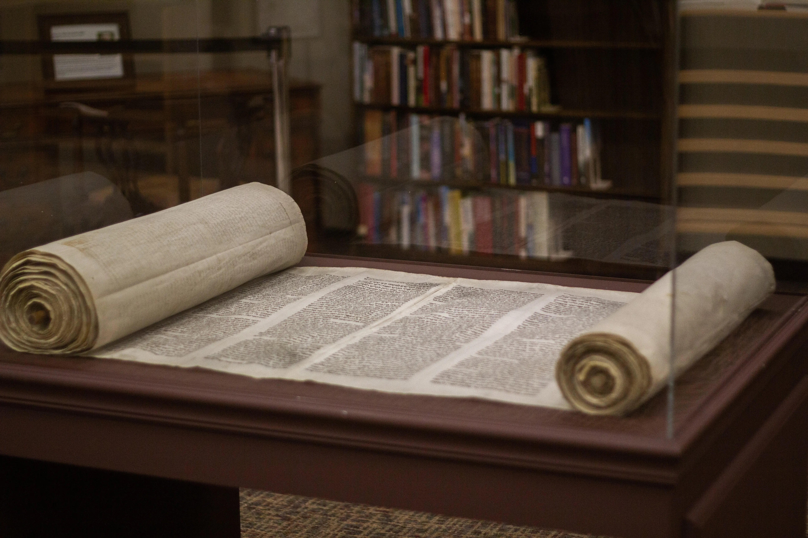

<div align='center'>
    <h1><code>docs-template</code></h1>
    <h3>An Advanced <a href="https://www.sphinx-doc.org"><b><i>Sphinx</i></b></a>-based Docs Site Template</h3>
    
    <hr/>
</div>

## Overview

This project is a template for creating advanced project documentation sites using Sphinx, the PyData Sphinx Theme, and many other tools.

---

## To View More Information

### Launch the Docs Site

```zsh
open docs/_build/html/index.html
```
